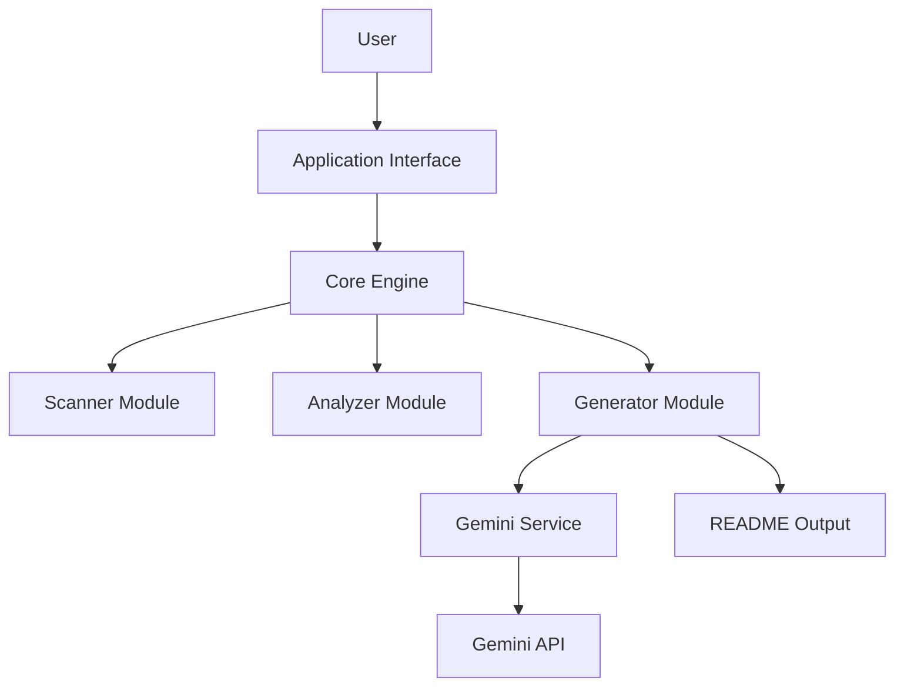

# fast-readme-ai


## Overview

fast-readme-ai is an AI-powered README generator designed for developers. It automates the creation of comprehensive documentation by analyzing project structure, technology stack, and key files. The tool offers a flexible interface, including a robust command-line interface (CLI) and a RESTful API, making it suitable for various integration use cases.

## Features

*   **AI-Powered Generation**: Leverages Google Gemini API to generate high-quality, detailed READMEs.
*   **Project Analysis**: Automatically detects programming languages, frameworks, databases, and package managers.
*   **Structured READMEs**: Generates standard sections like Overview, Features, Tech Stack, Getting Started, Usage, API Reference, and Architecture.
*   **Mermaid Diagrams**: Includes auto-generated Mermaid.js architecture diagrams for visual understanding.
*   **Flexible Input**: Supports generating READMEs from local project paths or remote GitHub repository URLs.
*   **Multiple Interfaces**: Provides a rich command-line interface (CLI) and a programmatic REST API.
*   **Streamlit Demo**: Includes an interactive web application for easy demonstration and use.

## Tech Stack

| Layer             | Technology                                   |
| :---------------- | :------------------------------------------- |
| Backend           | Python, FastAPI, Uvicorn                     |
| AI/ML             | Google Gemini API                            |
| CLI               | Typer, Rich                                  |
| Web UI (Demo)     | Streamlit                                    |
| Data Models       | Pydantic                                     |
| Repository Ops    | GitPython                                    |
| Frontend (Example)| JavaScript, Next.js, React                   |
| Databases (Example)| PostgreSQL, Redis, SQLAlchemy                |
| Package Managers  | pip, npm                                     |

## Project Structure

```
fast-readme-ai/
├── api/
│   ├── routes/
│   │   ├── __init__.py
│   │   └── readme.py
│   ├── __init__.py
│   └── main.py
├── cli/
│   ├── __init__.py
│   └── main.py
├── core/
│   ├── analyzer/
│   │   ├── __init__.py
│   │   ├── file_reader.py
│   │   └── stack_detector.py
│   ├── generator/
│   │   ├── __init__.py
│   │   ├── mermaid_builder.py
│   │   ├── prompt_builder.py
│   │   └── readme_writer.py
│   ├── models/
│   │   ├── __init__.py
│   │   └── schemas.py
│   ├── scanner/
│   │   ├── __init__.py
│   │   ├── directory_tree.py
│   │   └── repo_cloner.py
│   ├── services/
│   │   ├── __init__.py
│   │   └── gemini_service.py
│   ├── __init__.py
│   └── engine.py
├── demo/
│   └── streamlit_app.py
├── examples/
│   ├── sample_project/
│   │   ├── src/
│   │   │   └── app.py
│   │   ├── package.json
│   │   └── requirements.txt
│   └── sample_output_README.md
├── fast_readme_ai.egg-info/
│   ├── dependency_links.txt
│   ├── entry_points.txt
│   ├── PKG-INFO
│   ├── requires.txt
│   ├── SOURCES.txt
│   └── top_level.txt
├── tests/
│   ├── __init__.py
│   ├── test_api.py
│   ├── test_cli.py
│   ├── test_core_analyzer.py
│   └── test_core_generator.py
├── .env.example
├── .gitignore
├── config.py
├── full_dump.md
├── Makefile
├── pyproject.toml
├── README.md
├── start.py
├── test_gemini.py
└── TEST_README.md
```

## Getting Started

To get started with fast-readme-ai, follow these steps:

### Prerequisites

*   Python 3.11 or higher
*   Git (for cloning repositories)

### Installation

1.  **Clone the repository**:
    ```bash
    git clone https://github.com/your-username/fast-readme-ai.git
    cd fast-readme-ai
    ```
2.  **Install dependencies**:
    ```bash
    pip install .
    ```

### Environment Setup

1.  **Create a `.env` file**:
    Copy the provided example environment file:
    ```bash
    cp .env.example .env
    ```
2.  **Configure API Key**:
    Open the newly created `.env` file and add your Google Gemini API key:
    ```
    GEMINI_API_KEY="YOUR_GEMINI_API_KEY"
    ```

## Usage

### Command-Line Interface (CLI)

Generate a README for a local project or a remote GitHub repository:

```bash
# For a local project
fast-readme generate . --output MY_PROJECT_README.md

# For a remote GitHub repository
fast-readme generate https://github.com/tiangolo/fastapi --output FASTAPI_README.md
```

### RESTful API

1.  **Start the FastAPI server**:
    ```bash
    uvicorn api.main:app --host 0.0.0.0 --port 8000 --reload
    ```
    The API documentation will be available at `http://localhost:8000/docs`.

2.  **Make a request to generate a README**:
    ```bash
    curl -X POST "http://localhost:8000/api/v1/readme/generate" \
         -H "Content-Type: application/json" \
         -d '{"project_path": "./examples/sample_project", "output_filename": "generated_api_readme.md"}'
    ```
    Replace `./examples/sample_project` with your desired local project path or a GitHub URL.

### Streamlit Demo

Run the interactive Streamlit application for a user-friendly interface:

```bash
streamlit run demo/streamlit_app.py
```

## API Reference

The fast-readme-ai API provides the following endpoint:

| Method | Path                       | Description                                   |
| :----- | :------------------------- | :-------------------------------------------- |
| `POST` | `/api/v1/readme/generate`  | Generates a README for a given project path or GitHub URL. |

## Architecture



## Contributing

We welcome contributions to fast-readme-ai! If you'd like to contribute, please follow these steps:

1.  Fork the repository.
2.  Create a new branch (`git checkout -b feature/your-feature-name`).
3.  Make your changes and commit them (`git commit -m 'Add new feature'`).
4.  Push to the branch (`git push origin feature/your-feature-name`).
5.  Open a Pull Request.

Please ensure your code adheres to the project's coding standards and includes appropriate tests.

## License

This project is licensed under the MIT License - see the `LICENSE` file for details.
