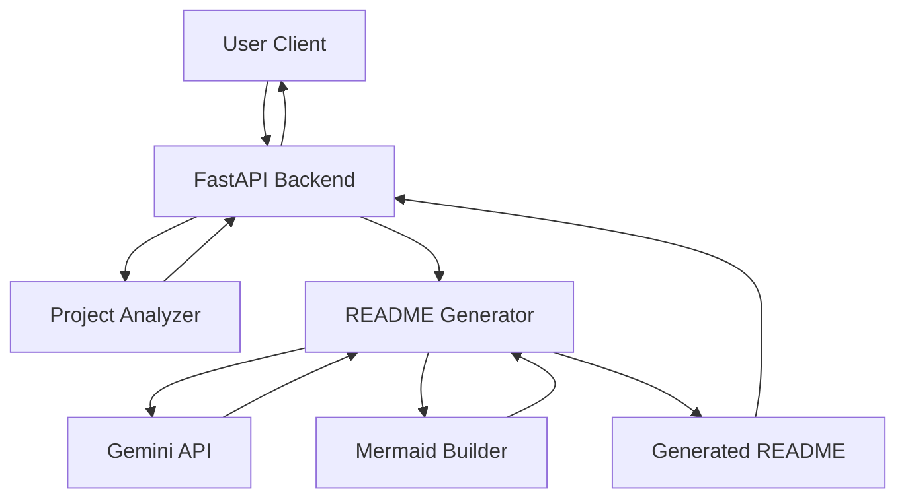

> 🤖 This README was generated automatically using **fast-readme-ai** — the AI documentation generator built in this repository.
 


# fast-readme-ai

[](https://www.python.org/)
[](https://opensource.org/licenses/MIT)

## Overview

`fast-readme-ai` is an intelligent tool designed to automate the generation of comprehensive `README.md` files for software projects. It analyzes a project's directory structure, detects its technology stack, reads key file contents, and leverages the Google Gemini API to produce a professional and detailed README, including architecture diagrams.

## Features

*   **Automated Project Analysis**: Scans project directories to identify structure, languages, frameworks, and dependencies.
*   **AI-Powered Content Generation**: Utilizes the Google Gemini API to create descriptive and accurate README content.
*   **Mermaid Diagram Integration**: Automatically generates visual architecture diagrams based on the detected tech stack.
*   **FastAPI Backend**: Provides a robust and scalable API for README generation requests.
*   **Streamlit Demo**: Offers an interactive web interface for easy project submission and README preview.
*   **Extensible Architecture**: Designed with modular components for easy expansion and integration of new analyzers or generators.

## Tech Stack

| Layer          | Technology                               |
| :------------- | :--------------------------------------- |
| **Languages**  | Python, JavaScript                       |
| **Frameworks** | FastAPI, Next.js, React                  |
| **Databases**  | PostgreSQL, Redis                        |
| **ORM**        | SQLAlchemy                               |
| **AI/ML**      | Google Gemini API                        |
| **Package Mgr**| pip, npm                                 |
| **Demo UI**    | Streamlit                                |

## Project Structure

```
73abd329-f6ef-4309-9d13-c96f8d954830/
├── analyzer/
│   ├── __init__.py
│   ├── directory_tree.py
│   ├── file_reader.py
│   ├── repo_cloner.py
│   └── stack_detector.py
├── backend/
│   ├── models/
│   │   ├── __init__.py
│   │   └── schemas.py
│   ├── routes/
│   │   ├── __init__.py
│   │   └── readme.py
│   ├── services/
│   │   ├── __init__.py
│   │   └── gemini_service.py
│   ├── __init__.py
│   ├── config.py
│   └── main.py
├── demo/
│   └── streamlit_app.py
├── examples/
│   ├── sample_project/
│   │   ├── src/
│   │   │   └── app.py
│   │   ├── package.json
│   │   └── requirements.txt
│   └── sample_output_README.md
├── generator/
│   ├── __init__.py
│   ├── mermaid_builder.py
│   ├── prompt_builder.py
│   └── readme_writer.py
├── tests/
│   ├── __init__.py
│   ├── test_analyzer.py
│   ├── test_api.py
│   └── test_generator.py
├── .env.example
├── .gitignore
├── Makefile
├── README.md
└── requirements.txt
```

## Getting Started

To get a local copy up and running, follow these simple steps.

### Prerequisites

*   Python 3.9+
*   Git
*   A Google Gemini API Key

### Installation

1.  **Clone the repository:**
    ```bash
    git clone https://github.com/your-username/fast-readme-ai.git
    cd fast-readme-ai
    ```

2.  **Create and activate a virtual environment:**
    ```bash
    python -m venv venv
    source venv/bin/activate  # On Windows use `venv\Scripts\activate`
    ```

3.  **Install Python dependencies:**
    ```bash
    pip install -r requirements.txt
    ```

### Environment Setup

1.  **Create a `.env` file:**
    Copy the `.env.example` file and rename it to `.env`:
    ```bash
    cp .env.example .env
    ```

2.  **Configure your Gemini API Key:**
    Open the newly created `.env` file and add your Google Gemini API key:
    ```
    GEMINI_API_KEY="YOUR_GEMINI_API_KEY_HERE"
    ```

## Usage

### Running the FastAPI Backend

To start the API server:

```bash
uvicorn backend.main:app --reload --host 0.0.0.0 --port 8000
```

The API will be accessible at `http://localhost:8000`.

### Running the Streamlit Demo

To launch the interactive demo application:

```bash
streamlit run demo/streamlit_app.py
```

The Streamlit app will open in your default web browser, typically at `http://localhost:8501`.

## API Reference

The `fast-readme-ai` backend exposes the following API endpoints:

| Method | Path         | Description                                     |
| :----- | :----------- | :---------------------------------------------- |
| `GET`  | `/`          | Root endpoint, returns tool name and version.   |
| `GET`  | `/health`    | Checks the health status of the API.            |
| `POST` | `/generate`  | Generates a README for a given project URL.     |

**Example `POST /generate` Request:**

```bash
curl -X POST "http://localhost:8000/generate" \
-H "Content-Type: application/json" \
-d '{
  "repo_url": "https://github.com/octocat/Spoon-Knife"
}'
```

## Architecture



## Contributing

Contributions are what make the open-source community such an amazing place to learn, inspire, and create. Any contributions you make are **greatly appreciated**.

1.  Fork the Project
2.  Create your Feature Branch (`git checkout -b feature/AmazingFeature`)
3.  Commit your Changes (`git commit -m 'Add some AmazingFeature'`)
4.  Push to the Branch (`git push origin feature/AmazingFeature`)
5.  Open a Pull Request

## License

Distributed under the MIT License. See `LICENSE` for more information.

