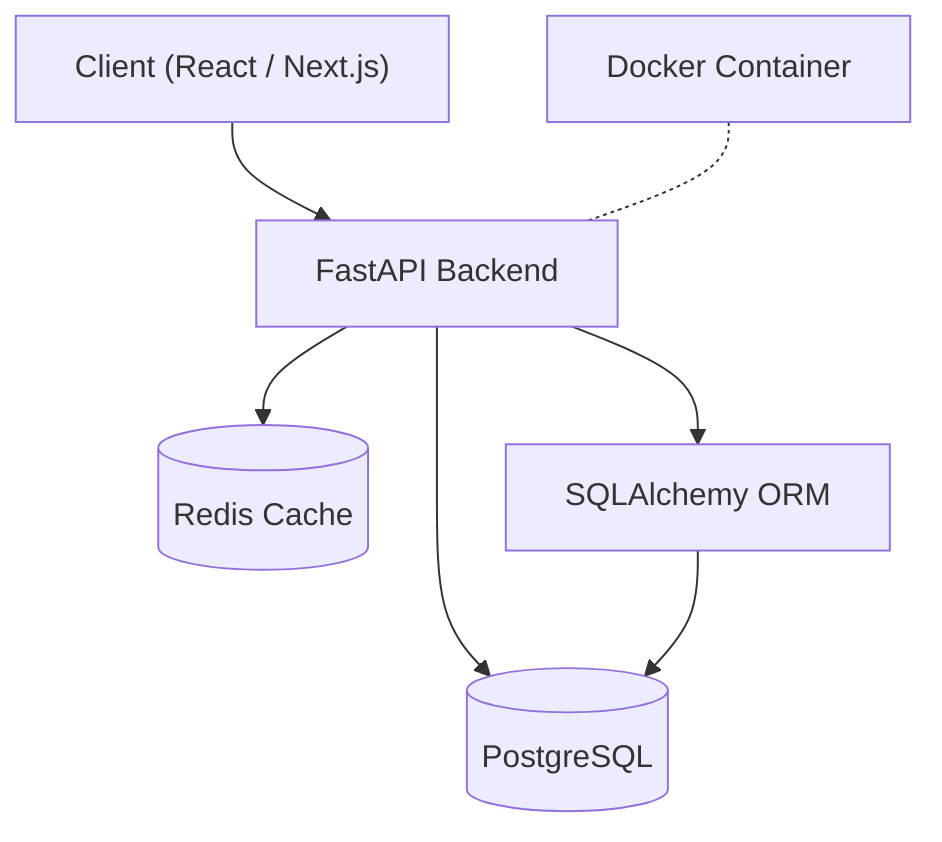

# TaskFlow Pro


## Overview

TaskFlow Pro is a full-stack task management application built with FastAPI and React. It provides a modern, responsive interface for managing tasks and projects, backed by a PostgreSQL database and Redis caching layer for optimal performance.

## Features

- 🚀 **RESTful API** — Fast and scalable API built with FastAPI
- ⚛️ **Modern Frontend** — React-based SPA with Next.js for SSR
- 🗃️ **Persistent Storage** — PostgreSQL database with SQLAlchemy ORM
- ⚡ **Caching** — Redis-powered caching for frequently accessed data
- 🔒 **Authentication** — JWT-based user authentication and authorization
- 📊 **Dashboard** — Real-time task analytics and project insights
- 🐳 **Dockerized** — Full Docker Compose setup for development and production

## Tech Stack

| Layer | Technology |
|---|---|
| Language | Python 3.11+, TypeScript 5.0 |
| Frontend | React 18, Next.js 14 |
| Backend | FastAPI |
| Database | PostgreSQL 16 |
| Caching | Redis 7 |
| ORM | SQLAlchemy 2.0 |
| Container | Docker, Docker Compose |

## Project Structure

```
taskflow-pro/
├── src/
│   └── app.py
├── requirements.txt
└── package.json
```

## Getting Started

### Prerequisites

- Python 3.11+
- Node.js 18+
- PostgreSQL 16
- Redis 7
- Docker (optional)

### Installation

1. **Clone the repository**

```bash
git clone https://github.com/example/taskflow-pro.git
cd taskflow-pro
```

2. **Install backend dependencies**

```bash
pip install -r requirements.txt
```

3. **Install frontend dependencies**

```bash
npm install
```

4. **Set up the environment**

```bash
cp .env.example .env
# Edit .env with your database credentials and API keys
```

5. **Run database migrations**

```bash
alembic upgrade head
```

## Usage

### Start the backend server

```bash
uvicorn src.app:app --reload --port 8000
```

### Start the frontend

```bash
npm run dev
```

### Using Docker

```bash
docker-compose up -d
```

## API Reference

| Method | Path | Description |
|---|---|---|
| `GET` | `/` | Root endpoint / health check |
| `GET` | `/users/{user_id}` | Get a user by ID |
| `POST` | `/tasks` | Create a new task |
| `GET` | `/tasks` | List all tasks |
| `PUT` | `/tasks/{task_id}` | Update an existing task |
| `DELETE` | `/tasks/{task_id}` | Delete a task |

## Architecture



## Contributing

Contributions are welcome! Please follow these steps:

1. Fork the repository
2. Create a feature branch (`git checkout -b feature/amazing-feature`)
3. Commit your changes (`git commit -m 'Add amazing feature'`)
4. Push to the branch (`git push origin feature/amazing-feature`)
5. Open a Pull Request

Please make sure to update tests as appropriate.

## License

This project is licensed under the MIT License — see the [LICENSE](LICENSE) file for details.
